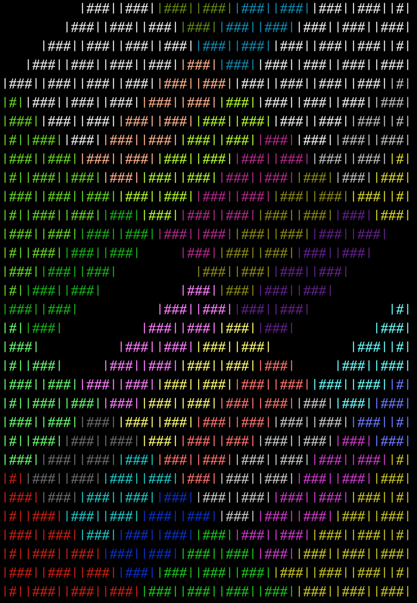

# Brick Buddy

Buddy wants to build a wall. He has a limit for how high and wide he can reach with his bricks, before he has to move. Sizes of the wall, bricks and Buddy's reach limits are defined in [Constants](./src/helpers/constants.js).

Buddy can create a _plan_ for a wall in a given bond. He creates an empty grid then adds the Bricks into the grid's cells to plan out the bond. He can build some bonds as well. This is interactive, you can step through the build brick by brick.

## How to run

Requires: node, npm

To visualise the wall and brick pattern:
```
npm run buddy:plan
```
To build the wall:
```
npm run buddy:build
```
For a full list of Buddy's commands, use:
```
npm run buddy
```

## Output

Buddy can build a wall !



But... his build isn't great. His doesn't move back left enough when starting a new row which means he misses opportunities to place bricks whilst in a stride in Stretcher Bond. This means it takes longer to build a wall.

(Checkout `/img` folder for other output screenshots)

Firstly, Buddy calculates the grid that he's operating in, based on the wall's height and width. Then he plans the bond within that grid. The intention with this appraoch was that Buddy could swap to other forms of Bond, however, it cannot handle bonds who are offset by a half brick (e.g. English Bond, who has header joints in the middle of a half brick).

## Next steps

- Fix: program exit incorrect
- Fix: correctly use the whole build envelope when building
- Allow user to skip interaction at each brick / stride step
- Create an output file with the wall's build information
- Make this an NPM package
