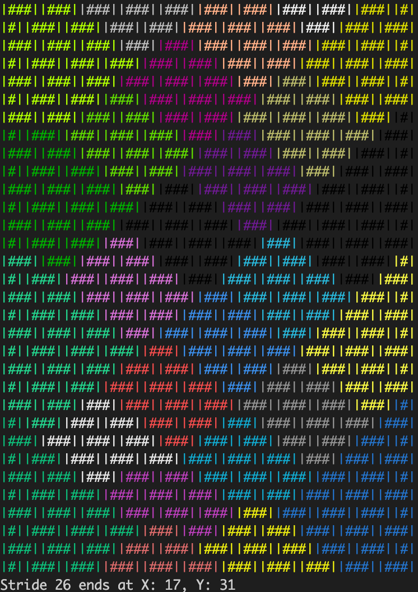

# Brick Buddy

Buddy wants to build a wall. He has a limit for how high and wide he can reach with his bricks, before he has to move. Sizes of the wall, bricks and Buddy's reach limits are defined in [Constants](./src/helpers/constants.js).

Buddy can create a _plan_ for a wall in a given bond. He creates an empty grid then adds the Bricks into the grid's cells to plan out the bond. He can build some bonds as well. This is interactive, you can step through the build brick by brick.

## How to run

Requires: node, npm

To visualise the wall and brick pattern:
```
npm run buddy:plan
```
To build the wall:
```
npm run buddy:build
```
For a full list of Buddy's commands, use:
```
npm run buddy
```

## Output

Buddy can build a wall ! 

This bond took 27 moves:


This bond began at [5,0] on the grid, and took 26 moves:


Check out the screenshots in the `img` folder for development history. 

### Approach

Firstly, Buddy calculates the grid that he's operating in, based on the wall's height and width. Then he plans the bond within that grid. The intention with this appraoch was that Buddy could swap to other forms of Bond, however, it needs refactoring to be able to handle bonds which have half brick offsets (e.g. English Bond).

## Next steps & ideas

- Fix: program exit incorrect
- Improve: extra loops and prints
- Allow user to skip interaction at each brick / stride step
- Improve the build algorithm!
- Change up mapping to allow for different bonds which have half brick offsets
- Create an output file with the wall's build information
- Make this an NPM package ?
